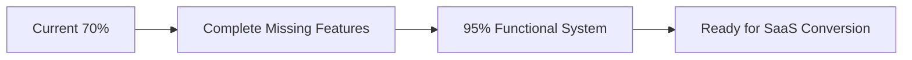
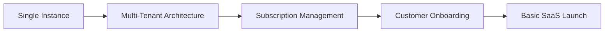
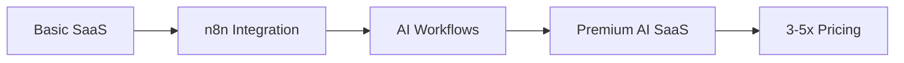
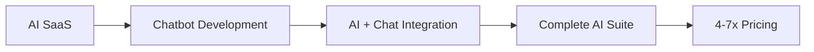

# SaaS Planning Documentation

## Overview
This folder contains comprehensive planning documents for converting the warehouse management system into a SaaS platform with optional AI enhancement capabilities.

## Documents

### 📋 [COMPLETION_ROADMAP.md](./COMPLETION_ROADMAP.md)
**Current Status**: ~70% functional warehouse system  
**Purpose**: Complete the remaining 30% of functionality before SaaS conversion

**Key Missing Features**:
- Edit Task functionality
- Edit Category functionality  
- Sales Export (CSV/PDF)
- Print Receipt system
- Warranty Management

**Timeline**: 4-6 weeks to reach 95%+ functional

### 🚀 [SAAS_CONVERSION_PLAN.md](./SAAS_CONVERSION_PLAN.md)
**Purpose**: Strategic plan for converting to multi-tenant SaaS platform

**Conversion Approaches**:
1. **WordPress Multisite** (Easiest setup)
2. **Pure Multi-Tenant** (Shared database)
3. **Hybrid Multi-Tenant + Separate DBs** ⭐ (Recommended)
4. **Containerized** (Most scalable)
5. **AI-Enhanced SaaS** ⭐ (Premium differentiator)

**Revenue Projections**:
- Basic SaaS: $99-199/month per customer
- AI-Enhanced: $299-999/month per customer
- Target: 50-200 customers within Year 1

### 🤖 [N8N_WORKFLOWS.md](./N8N_WORKFLOWS.md)
**Purpose**: AI automation workflows using n8n platform

**Core AI Workflows**:
1. **Smart Inventory Reordering** - Predictive restocking
2. **Intelligent Task Assignment** - Optimal team allocation
3. **Sales Intelligence** - Pricing and demand optimization
4. **Supply Chain Risk Management** - Proactive risk mitigation
5. **Customer Retention** - Churn prediction and prevention

**Implementation Cost**: $15,000-25,000 (2-3 months development)  
**Monthly Operating Cost**: $200-500 (AI APIs + hosting)  
**Expected ROI**: 3-5x pricing premium justification

### 💬 [CHATBOT_INTEGRATION.md](./CHATBOT_INTEGRATION.md)
**Purpose**: 24/7 intelligent chatbot support with AI workflow integration

**Core Chatbot Features**:
1. **Real-time Warehouse Queries** - Inventory, tasks, sales data
2. **Smart Task Management** - Create and manage tasks via chat
3. **Intelligent Troubleshooting** - Automated problem resolution
4. **AI Workflow Integration** - Natural language triggers for n8n workflows
5. **Proactive Notifications** - AI-driven alerts and insights

**Implementation Cost**: $33,000 (9-13 weeks development)  
**Monthly Operating Cost**: $275-475 (OpenAI + hosting)  
**Expected Benefits**: 70% query automation, 90%+ customer satisfaction

### 🐳 [CONTAINERIZED_ARCHITECTURE.md](./CONTAINERIZED_ARCHITECTURE.md)
**Purpose**: Enterprise-grade containerized multi-tenant architecture for premium tiers

**Key Advantages**:
1. **Ultimate Security** - Complete process and data isolation per customer
2. **Enterprise Customization** - Different app versions, themes, features per customer
3. **Compliance Ready** - SOC2, HIPAA, GDPR requirements easier to meet  
4. **Guaranteed Performance** - Dedicated resources with auto-scaling
5. **Risk Mitigation** - Complete isolation prevents cross-customer issues

**Implementation Cost**: $45,000-65,000 (12-17 weeks development)  
**Monthly Infrastructure**: $25-150 per customer (tier-dependent)  
**Recommended for**: AI Enhanced ($399/month) and Enterprise ($699/month) tiers

## Implementation Strategy

### Phase 1: Core Completion (4-6 weeks)

**Priority**: Complete all missing functionality first
- Edit Task/Category functions
- Export capabilities
- Print receipt system
- Warranty management
- Performance optimization

### Phase 2: SaaS Conversion (2-3 months)

**Recommended Approach**: 
- **Starter/Professional Tiers**: Hybrid Multi-Tenant + Separate Databases
- **AI Enhanced/Enterprise Tiers**: Containerized Multi-Tenant Architecture

**Benefits by Tier**:
- Perfect data isolation across all tiers
- Enterprise-grade security for premium customers
- Customization capabilities justify premium pricing
- Scalable architecture that grows with business

### Phase 3: AI Enhancement (2-3 months) - Optional Premium

### Phase 4: Chatbot Integration (2-3 months) - Ultimate Premium

**Combined Value Proposition**: Transform to fully intelligent, self-managing warehouse
- 20-30% reduction in stockouts (AI workflows)
- 40-50% faster task completion (AI + Chat)
- 70% query automation (Chatbot)
- 90%+ customer satisfaction (24/7 support)
- 15-35% revenue increase per customer
- Ultimate competitive moat

## Financial Projections

### Scenario A: Basic SaaS (No AI/Chatbot)
| Customers | Mix | Monthly Revenue | Annual Revenue |
|-----------|-----|-----------------|----------------|
| 25        | 15 Starter + 10 Pro | $4,470         | $53,640        |
| 50        | 30 Starter + 20 Pro | $8,940         | $107,280       |
| 100       | 60 Starter + 40 Pro | $17,880        | $214,560       |
| 200       | 120 Starter + 80 Pro | $35,760        | $429,120       |

*Average pricing: $179/month (weighted)*

### Scenario B: AI + Chatbot Enhanced SaaS
| Customers | Mix | Monthly Revenue | Annual Revenue | Premium |
|-----------|-----|-----------------|----------------|---------|
| 25        | 10 Pro + 12 AI + 3 Enterprise | $11,365        | $136,380       | +154%   |
| 50        | 20 Pro + 25 AI + 5 Enterprise | $23,425        | $281,100       | +162%   |
| 100       | 30 Pro + 50 AI + 20 Enterprise | $49,900        | $598,800       | +179%   |
| 200       | 50 Pro + 120 AI + 30 Enterprise | $107,670       | $1,292,040     | +201%   |

*Average pricing: $499/month (weighted with AI/Chatbot tiers)*

### Scenario C: Premium Mix (Heavy AI Adoption)
| Customers | Mix | Monthly Revenue | Annual Revenue | Premium |
|-----------|-----|-----------------|----------------|---------|
| 25        | 5 Pro + 15 AI + 5 Enterprise | $11,470        | $137,640       | +157%   |
| 50        | 10 Pro + 30 AI + 10 Enterprise | $23,940        | $287,280       | +168%   |
| 100       | 15 Pro + 60 AI + 25 Enterprise | $50,385        | $604,620       | +182%   |
| 200       | 20 Pro + 120 AI + 60 Enterprise | $106,940       | $1,283,280     | +199%   |

*Average pricing: $535/month (heavy enterprise adoption)*

### Break-Even Analysis
- **Basic SaaS**: 10-15 customers (break-even on $99-199 tiers)
- **AI-Enhanced**: 8-12 customers (break-even including AI costs $400/month)
- **AI + Chatbot**: 5-8 customers (break-even including full infrastructure $750/month)
- **Payback Period**: 3-6 months (accelerated with premium tiers)

## Competitive Analysis

### Current Market (Traditional Warehouse SaaS)
- **inFlow Inventory**: $99-399/month
- **Fishbowl**: $299-899/month  
- **TradeGecko**: $199-999/month
- **Cin7**: $299-999/month

### Our Advantage
✅ **Complete Feature Set**: Already 70% functional  
✅ **Modern Tech Stack**: PWA, mobile-optimized  
✅ **AI Differentiator**: n8n automation layer  
✅ **Pricing Flexibility**: Can compete at any tier  
✅ **Fast Time-to-Market**: Core system mostly built  

## Next Steps

### Decision Points
1. **Complete core features first** or **parallel SaaS development**?
2. **Launch basic SaaS** then **add AI** or **build AI-enhanced from start**?
3. **Target market**: SMBs ($99-299/month) or Enterprise ($299-999/month)?

### Recommended Path
1. ✅ **Complete core features** (4-6 weeks)
2. ✅ **Launch basic SaaS** with hybrid multi-tenant approach (2-3 months)
3. ✅ **Add AI layer** as premium upgrade (2-3 months)
4. ✅ **Scale customer acquisition** (ongoing)

### Resource Requirements
- **Development**: 1-2 full-time developers + AI/Chatbot specialist
- **SaaS Infrastructure**: $100-500/month (hosting, databases)
- **AI Infrastructure**: $200-500/month (n8n, OpenAI APIs)
- **Chatbot Infrastructure**: $275-475/month (OpenAI, WebSocket hosting)
- **Total Monthly Operating**: $575-1,475/month (full AI + Chatbot suite)
- **Marketing/Sales**: Customer acquisition budget
- **Support**: Reduced need with AI chatbot (60-70% automation)

## Risk Mitigation

### Technical Risks
- **Data Migration**: Backup and testing protocols
- **Performance**: Load testing with multiple tenants
- **Security**: Proper data isolation and encryption
- **AI Reliability**: Fallback to manual processes

### Business Risks
- **Market Competition**: Focus on AI differentiator
- **Customer Acquisition**: Strong onboarding and support
- **Pricing Strategy**: Flexible tiers to match market needs
- **Technical Debt**: Complete core features before scaling

## Success Metrics

### Technical KPIs
- System uptime: 99.9%
- Page load times: <2 seconds
- Mobile responsiveness: 100%
- Feature completeness: 95%+

### Business KPIs
- Customer acquisition: 5-10 new customers/month
- Churn rate: <5% monthly
- Revenue growth: 20-30% monthly
- Customer satisfaction: 90%+ NPS

### AI Enhancement KPIs
- Task automation: 50%+ reduction in manual work
- Inventory optimization: 20-30% stockout reduction
- Revenue increase: 15-25% per customer
- Premium conversion: 60%+ basic to AI upgrade

---

**Last Updated**: December 2024  
**Status**: Planning Complete - Ready for Implementation  

### Complete Implementation Summary

| Phase | Timeline | Development Cost | Features |
|-------|----------|------------------|----------|
| **Core Completion** | 4-6 weeks | Existing development | Missing 30% functionality |
| **Basic SaaS (Hybrid)** | 2-3 months | $20,000-30,000 | Multi-tenant, billing, onboarding |
| **Containerized Architecture** | 12-17 weeks | $45,000-65,000 | Enterprise isolation, customization |
| **AI Workflows** | 2-3 months | $15,000-25,000 | n8n automation, predictive insights |
| **Chatbot Integration** | 9-13 weeks | $33,000 | 24/7 support, natural language interface |

**Total Estimated Timeline**: 
- **Hybrid SaaS + AI + Chatbot**: 10-15 months
- **Full Containerized + AI + Chatbot**: 15-20 months

**Total Estimated Investment**: 
- **Hybrid Approach**: $68,000-88,000 development cost
- **Containerized Approach**: $113,000-148,000 development cost (includes enterprise features)

**Monthly Operating Costs**: 
- **Hybrid**: $575-1,475 (shared infrastructure + AI/Chatbot)
- **Containerized**: $25-150 per customer (dedicated resources)

**Projected Annual Revenue**: $136,000-1,292,000 (25-200 customers)  
**Break-even Point**: 
- **Hybrid**: 5-8 customers total
- **Containerized**: 1 customer per tier (immediate profitability)

**ROI Potential**: 1,500-1,900% annual return on investment 